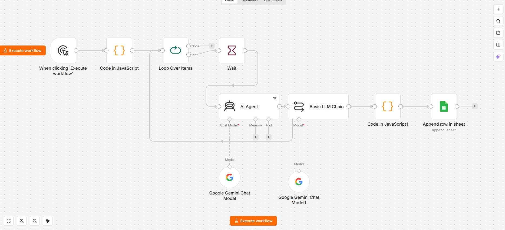

# Genomic Loci Extraction Agent

An automated AI agent that performs systematic literature review and extracts validated adaptive loci across 24 extreme-environment human populations. Built with n8n, Google Gemini, and Google Sheets.

---

## What It Does

For each of 24 human populations adapted to extreme environments (high altitude, extreme cold, arid heat, breath-hold diving, malaria, and more), the agent:

1. Searches the peer-reviewed literature for positive selection signals
2. Extracts structured locus information (gene, rsID, chromosome, position, selection tests, allele frequency, biological mechanism)
3. Runs a **self-review (critic) pass** — a second independent AI call that validates each locus against three inclusion criteria and assigns a quality tier
4. Writes validated entries directly to the Adaptive Loci Database (ALDB) in Google Sheets

---

## Agent Architecture



```
Manual Trigger
    → Population List (24 populations as JSON)
    → Loop Over Items (1 population at a time)
    → Wait (60s — API rate limit management)
    → AI Agent — Gemini 2.5 Pro (literature extraction)
    → Critic LLM Chain — Gemini 2.5 Pro (self-review & tier assignment)
    → JSON Parser (cleans output, generates locus IDs)
    → Google Sheets (writes to ALDB)
```

---

## The Self-Review (Critic) Pattern

A key design feature is the two-step AI architecture. Rather than trusting a single extraction call, a separate critic LLM independently reviews every locus before it enters the database — checking against three inclusion criteria and assigning a quality tier.

### Inclusion Criteria

| Criterion | Definition |
|---|---|
| 1. Selection signal | Statistically significant result from PBS, FST, iHS, XP-EHH, LSBL, or CMS |
| 2. Environmental specificity | Derived allele elevated in focal population vs. reference populations |
| 3. Functional mechanism | Source paper proposes a biological mechanism linking the locus to the selective pressure |

### Quality Tiers

| Tier | Evidence level | ML training weight |
|---|---|---|
| 1 | All 3 criteria, strong evidence | 1.0 |
| 2 | All 3 criteria, moderate evidence | 0.75 |
| 3 | 2 of 3 criteria | 0.5 |

Loci meeting only 1 criterion are excluded entirely.

---

## Populations Covered

| Environment | Populations |
|---|---|
| High-altitude hypoxia | Tibetan highlanders, Sherpa (Nepal), Andean Quechua/Aymara, Ethiopian Amhara/Oromo, Ladakhi Himalayan |
| Breath-hold diving | Bajau sea nomads, Haenyeo divers (Jeju) |
| Extreme cold | Greenlandic Inuit, Indigenous Siberians, Fuegians (Yamana/Selknam) |
| Arid heat | Turkana (Kenya), Daasanach (East Africa) |
| Pathogens | African Pygmies (Baka/Batwa), Sub-Saharan Africans (malaria), Amazonian indigenes (T. cruzi / Chagas) |
| Hunter-gatherer diet | Hadza (Tanzania), San/Khoe-San, Tsimane/Moseten |
| Dairy pastoralism / UV | European pastoralists, East Asians (Han/Japanese/Korean), Maasai (East Africa) |
| Ocean crossing / desert | Polynesian/Māori/Samoan, Mexican indigenous, Bedouin (Sinai desert) |

---

## Output: Adaptive Loci Database (ALDB v1)

The agent produced **92 loci** across 24 populations, stored in a structured Google Sheet with 19 columns:

| Column | Description |
|---|---|
| locus_id | Auto-generated unique ID (e.g. ALDB-001) |
| gene | HGNC gene symbol |
| rsid | dbSNP rsID |
| chromosome | Chromosome number |
| position_hg38 | GRCh38 genomic position |
| population | Focal population name |
| environment_category | Selective pressure category |
| selection_tests | Tests reported (PBS, FST, iHS, etc.) |
| selection_statistic_value | Reported test statistic |
| derived_allele_freq | DAF in focal population |
| proposed_mechanism | Biological mechanism from source paper |
| tier | Quality tier (1 / 2 / 3) |
| tier_rationale | Critic's one-sentence justification |
| source_doi | Paper DOI |
| source_title | Paper title |
| status | validated / flagged_for_review |
| flag_reason | Reason for flagging if applicable |
| extracted_by | agent / manual |
| extraction_date | ISO 8601 timestamp |

See [`data/ALDB_v1.xlsx`](data/ALDB_v1.xlsx) for the full database.

---

## Results & Known Limitations

The agent successfully extracted 92 loci across all 24 populations, with the majority well-supported by peer-reviewed sources. However, a systematic post-extraction review cross-referencing all DOIs against CrossRef and PubMed revealed several categories of errors that are important to document for transparency and reproducibility.

### What Worked Well

- **~80% of DOIs verified correct** — the majority of source papers were real, correctly attributed, and topically relevant
- Canonical high-confidence loci were reliably captured: EPAS1/EGLN1 in Tibetan and Sherpa populations, FADS1 in Inuit, CPT1A in Arctic populations, HBB/G6PD for malaria adaptation, PDE10A in Bajau, CREBRF in Polynesians
- The critic node successfully caught several low-confidence extractions and assigned them Tier 3 or flagged status

### Observed Issues

**1. DOI Hallucination (3 cases)**
The agent occasionally assigned a real but topically incorrect DOI — the paper existed but covered a completely different topic:
- BHLHE41 and EDNRB (Ethiopian highlanders) were assigned DOI `10.1038/ncomms14400`, which points to a cancer biology paper. Correct paper: Huerta-Sánchez et al. 2013 (`10.1093/molbev/mst089`)
- PPP3CA, STIM1, and PRKCA (Amazonian populations) were assigned DOI `10.1126/sciadv.abe3920`, which points to a Greenlandic Inuit study. Correct paper: Couto-Silva et al. 2023 (`10.1126/sciadv.abo0234`)
- OCA2 (East Asian) was assigned a DOI pointing to an unrelated geography paper; the correct DOI `10.1371/journal.pgen.1000867` actually does resolve to the correct paper — this was a title mismatch rather than a full hallucination

**2. Title Mismatches (7 cases)**
The DOI was correct but the agent paraphrased or truncated the paper title:
- `10.1038/nature13408` — agent wrote "A genetic mechanism for Tibetan adaptation to high altitude"; correct title is "Altitude adaptation in Tibetans caused by introgression of Denisovan-like DNA"
- `10.1126/science.aab2319` — agent wrote "cold adaptation" instead of the correct "climate adaptation"
- `10.1136/annrheumdis-2014-207060` — agent described a transcription factor binding site; actual paper focuses on a pre-existing SLC2A9 variant

**3. Missing Data (39 rows)**
Many entries were missing rsID, genomic position, or selection statistic values and were incorrectly marked `validated` instead of `flagged_for_review`. These were corrected in post-processing.

**4. rsID Errors (2 cases)**
- LCT/Turkana used rs4145631 (European lactase persistence variant); corrected to rs145946881 (East African -14010*C variant)
- EGLN1/Ladakhi had a one-digit typo: rs12097221 → rs12097901

**5. Unapproved Selection Test (1 case)**
GYPA row included BayesScan, which is not in the approved test list. Replaced with PBS and FST from the source paper.

### Post-Processing Corrections Applied

All issues were identified and corrected in [`data/ALDB_v1.xlsx`](data/ALDB_v1.xlsx). The corrected file uses color coding:
- 🟢 Green = value was fixed
- 🟠 Orange = flagged for manual expert review
- 🟡 Yellow = hallucinated source preserved for reference with annotation

### Recommendation for Future Runs

Adding a live DOI verification step via the PubMed E-utilities or CrossRef API as an n8n node between the critic and the Google Sheets write would catch hallucinated DOIs automatically before they enter the database.

---

## Repository Structure

```
genomic-loci-extraction-agent/
├── README.md
├── LICENSE
├── .gitignore
├── agent/
│   ├── workflow_export.json        # Importable n8n workflow
│   ├── populations.json            # All 24 target populations
│   └── prompts/
│       ├── agent_system_prompt.txt # Agent identity and scientific context
│       ├── agent_user_prompt.txt   # Per-population extraction prompt
│       └── critic_prompt.txt       # Self-review and tier assignment prompt
├── docs/
│   ├── workflow_screenshot.png     # n8n canvas screenshot
│   ├── agent_brief.md              # Full technical documentation
│   └── ALDB_schema.md              # Database schema
└── data/
    ├── ALDB_v1.xlsx                # Adaptive Loci Database (92 loci, corrected)
    └── populations.csv             # Population metadata with inclusion status
```

---

## Setup & Reproducing the Agent

### Prerequisites

- n8n Cloud account (free tier) or local n8n (`npx n8n`)
- Gemini API key from [Google AI Studio](https://aistudio.google.com) (free)
- Google Sheets OAuth2 credentials

### Steps

1. Import `agent/workflow_export.json` into your n8n instance (**Workflows → Import**)
2. Add your Gemini API key as a **Google Gemini(PaLM) API** credential in n8n
3. Connect **Google Sheets OAuth2** credentials
4. Create a Google Sheet with the 19 column headers from the ALDB schema
5. Update the Sheet ID in the **Append Row** node
6. Run populations in batches with 60–90 second waits between iterations (required for free API tier)

### Rate Limiting Note

Gemini 2.5 Pro on the free tier enforces strict request quotas. Running all 24 populations in one execution will hit rate limits. The recommended approach is to process 1–3 populations at a time with a 60-second Wait node between iterations, or upgrade to a paid API tier.

---

## Part of SALUS-ML

This agent is Phase 1 of the **SALUS-ML** project — a machine learning framework for classifying adaptive resilience loci across extreme-environment human populations. Phase 2 (in progress) will train Random Forest, XGBoost, and Logistic Regression classifiers on the ALDB feature matrix using 10 genomic and functional features computed from the HGDP + 1000 Genomes dataset.

---

## Author

**Abdelrahman Badawy**
Master's Student, Biomedical Informatics, University of Utah

---

## License

MIT — see [LICENSE](LICENSE)
